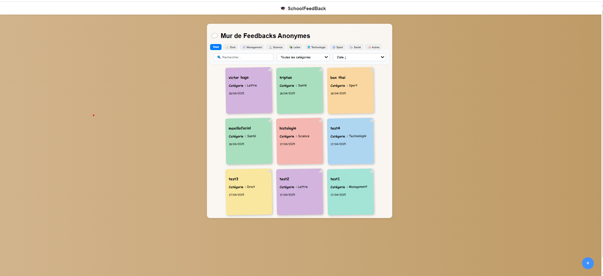
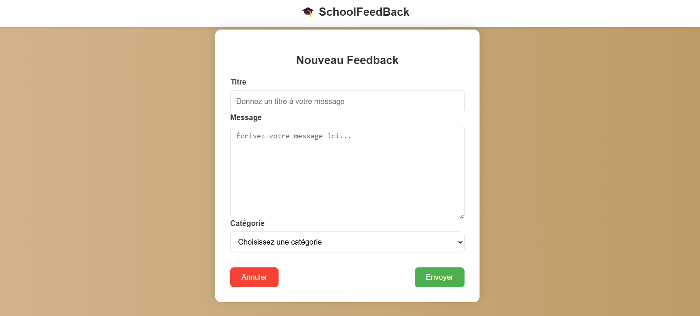

# Mini Feedback App

Une application de feedbacks anonymes pour étudiants, avec la possibilité d'ajouter des commentaires accompagnés d'une image (via URL ou importée).

*Capture 1 : Mur de feedbacks*
## Fonctionnalités Principales

- 📝 Publication de feedbacks anonymes
- 🏷️ Catégorisation des feedbacks (Droit, Science, Management, etc.)
- 🔍 Système de recherche et filtrage
- 📅 Tri par date ou par titre
- 📱 Interface responsive
  
# Stack Technique

- **Frontend** : React, JSX, CSS

- **Backend** : PHP (avec gestion des fichiers JSON)

- **Base de données** : Fichier JSON pour stocker les feedbacks

- **Stockage des images** : Importation locale ou URL
- **Tests** : Jest, Testing Library
## Tests Automatisés

L'application inclut une suite complète de tests automatisés :

### Tests Frontend

```bash
npm test  # Exécute tous les tests
```

## Couverture des tests :

1. **Liste des Feedbacks**

- Affichage avec plusieurs feedbacks

- Affichage avec un seul feedback

- Cas d'aucun feedback

- Mise à jour dynamique

- Tri par date/titre

2. **Publication de Feedbacks**

- Validation du formulaire

- Soumission réussie

- Gestion des erreurs

- Réinitialisation après soumission

2. **Recherche/Filtrage**

- Recherche par terme valide

- Recherche insensible à la casse

- Recherche par terme partiel

- Filtrage par catégorie
  

Capture 2 : Formulaire de publication


# Installation de l'environnement

## Prérequis

Avant de commencer l'installation, assurez-vous d'avoir les éléments suivants installés sur votre machine :

1. **Node.js** et **npm** : Pour installer les dépendances du frontend.

- Téléchargez et installez [Node.js](https://nodejs.org/fr).
- Vérifiez l'installation avec :

`node -v`
puis
 `npm -v`

2. **Serveur PHP** : Pour faire fonctionner le backend PHP.

    - Vous pouvez utiliser un serveur local comme XAMPP, WAMP, MAMP ou PHP intégré.

    - Téléchargez [XAMPP](https://www.apachefriends.org) et installez-le.

3. **Git** : Pour versionner votre code.

    - Téléchargez et installez [Git](https://git-scm.com/).
    
    - Vérifiez l'installation avec : `git --version`

4.  **Un éditeur de code** : Par exemple, [VSCode](https://code.visualstudio.com/).

## Étapes d'Installation

1. **Clonez le dépôt**

    Commencez par cloner ce projet sur votre machine locale avec Git : `git clone https://github.com/votre-utilisateur/mini-feedback-app.git`

2. **Configuration du Backend (PHP)**

    - Ouvrez le dossier backend dans votre éditeur de code.

    - Vérifiez que le fichier `feedbacks.json` existe dans le dossier `data/.` Si ce n'est pas le cas, créez-le manuellement.

    - Si vous utilisez XAMPP, assurez-vous que le serveur Apache fonctionne. Copiez le dossier backend dans le dossier htdocs de XAMPP : `C:\xampp\htdocs\mini-feedback-app\backend\`

    - Accédez à `http://localhost/mini-feedback-app/backend` dans votre navigateur pour tester que le backend est bien accessible.

3. **Configuration du Frontend (React)**

    - Ouvrez un terminal dans le dossier frontend.

    - Installez les dépendances avec npm : `npm install`

    - Lancez le serveur de développement avec : `npm run dev`

    - Accédez à l'application sur `http://localhost:3000 ` dans votre navigateur.

# Utilisation

## Ajouter un Feedback

1. Ouvrez l'application dans votre navigateur `(http://localhost:3000) `.

2. Rédigez un feedback dans le champ de texte.

3. Vous pouvez soit :

     - Ajouter un lien vers une image en utilisant le champ URL.

     - Importer une image depuis votre bureau en utilisant le bouton d'importation.

4. Cliquez sur Envoyer pour soumettre votre feedback.

## Voir les Feedbacks

Les feedbacks soumis s'affichent sous forme de liste. Vous pouvez les visualiser dans l'application sur la même page.


Capture 3 : Exemple de feedback publié


# Développement

## Structure des Dossiers

- `frontend/` : Contient tout le code React.

    - `src/` : Code source de l'application frontend.

    - `components/` : Contient les composants React, comme le formulaire de feedback et la liste des feedbacks.

    - `App.js` : Point d'entrée principal de l'application React.

- `backend/` : Contient le serveur PHP et les fichiers associés.

    - `api/feedbacks.php `: Point de terminaison API qui gère les requêtes pour récupérer et ajouter des feedbacks.

    - `data/feedbacks.json` : Fichier de stockage des feedbacks (format JSON).

## Commandes Utiles

**Frontend**

- Installation des dépendances : `npm install`

- Démarrer le serveur de développement : `npm run dev`

- Construire l'application pour la production : `npm run build`

**Backend**

- Démarrer le serveur PHP intégré : Dans le dossier `backend`, exécutez la commande suivante :

`php -S localhost:8000`

Cela démarrera un serveur local qui servira le backend PHP à l'adresse `http://localhost:8000`.

# Auteurs

- [Amani GHARBI](https://github.com/amanigharbi)
- [afef23](https://github.com/afef23)
- [Arraymanios](https://github.com/Arraymanios)
